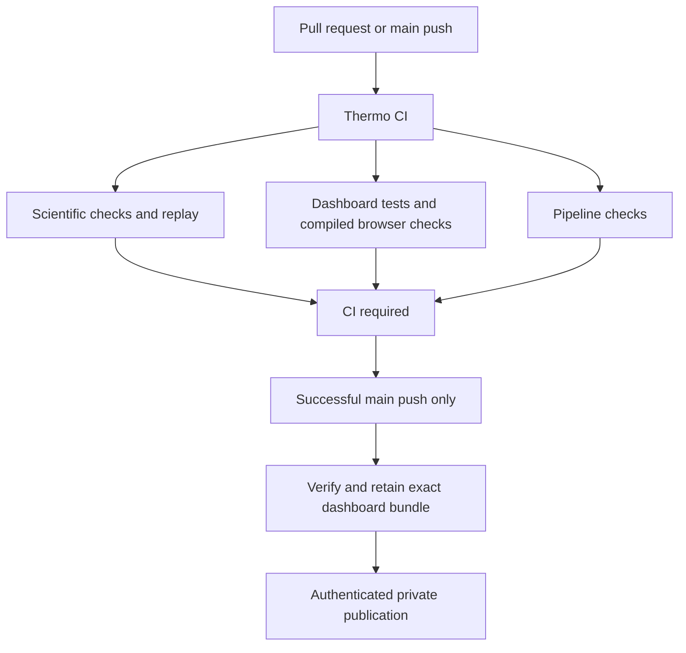

# Thermo CI and dashboard delivery

Every pull request, main push, merge-queue group and manual CI run enters
**Thermo CI**. Its single **CI required** check succeeds only after all seven
job groups succeed: pipeline validation, scientific gates, dashboard, objective
fixture, return fixture, hop-fidelity pilot and full-row pilot. A cancelled,
failed or skipped group fails the aggregate. There are no path filters that can
leave required checks pending or silently omit a scientific gate.



The four fixture workflows are included in the scientific branch of this diagram.
Only the final publication step is operator-run. **A green Dashboard delivery run
means a verified bundle is available; it does not mean the live site changed.**

## Build and test policy

- Scientific commands, budgets, matrix partitions, replay assertions and evidence
  boundaries are preserved. Negative scientific findings remain valid evidence.
- Python remains 3.11; uv is pinned to 0.12.17 and uses `uv sync --frozen`.
  The scientific gate checks lock consistency, Ruff, package contents and all
  existing unit/integration/slow/experiment partitions.
- Node remains 24 with `npm ci`. Dashboard unit tests, typecheck and export/build
  precede Chromium tests against `vite preview`, then packaging of that exact dist.
- Actions use verified full commit pins; checkout never persists credentials.
  Workflows have read-only repository permissions and finite job timeouts.
  No workflow uses `pull_request_target`, executes artifacts, or receives a
  production secret. Dependabot proposes weekly action/dashboard dependency PRs;
  it does not auto-merge or update scientific 0.x dependencies.
- PR/merge-queue superseded runs are cancelled. Main runs are not interrupted;
  GitHub may replace a pending run with a newer pending run in the same group.
- Workflow syntax is checked with official actionlint 1.7.12, whose downloaded
  binary is bound to a reviewed SHA-256 digest. Delivery tests use Python's
  standard library and exercise fail-closed behavior.

## Release identity and retained evidence

The dashboard job uploads `dashboard-RUN_ID-ATTEMPT` only after all of its checks
pass. Other CI groups must also pass before automatic delivery starts.

| File | Purpose |
| --- | --- |
| `dashboard.tar.gz` | Exact tested static `dist/` plus embedded `release.json` |
| `release.json` | Full source SHA, repository, source run/attempt and every file hash |
| `SHA256SUMS` | Transport checksums for the archive and manifest |
| `delivery.json` | Selected successful CI attempt and actual dashboard producer attempt (delivery artifact only) |

The bundle is deterministic for identical dist bytes and identity. A fresh build
may have a different export timestamp, so builds at the same source SHA are not
claimed byte-identical. Run and attempt distinguish those builds.

Delivery verifies the source through GitHub's API: same repository and head
repository, `ci.yml`, successful completed **push** on **main**, full SHA, selected
run ID and attempt. The latest actual successful dashboard job and its successful
artifact-upload step identify the build attempt. This may be earlier than the CI
attempt when GitHub reruns only failed scientific jobs. No older artifact is
substituted if the selected producer artifact is missing. Automatic delivery also requires the source to still be the
current main commit, rechecked immediately before retention together with the
original CI/build attempt selection. This prevents an
older run finishing late from becoming the ordinary delivery candidate. It does
not atomically lock main; the publication operator rechecks it before deployment.

The verifier never extracts or executes incoming tar members. It rejects duplicate
or unlisted paths, traversal, links, changed files, identity mismatches, missing
M4G cell details, unavailable recent studies and oversized archives. Decompressed
bytes are bounded before tar parsing, including PAX/GNU metadata headers. SHA-256 here
provides integrity checks, not an independent signature or a SLSA certification;
trust in the producer comes from the GitHub run/artifact binding.

Verified delivery bundles and CI bundles are retained for 90 days; Chromium
screenshots/traces for 14 days. Download a release bundle before expiry if it must
remain a rollback candidate. Existing scientific evidence retention is preserved.
An unavailable/expired bundle fails delivery; it is never silently rebuilt.

## Activate once after merging

1. Merge PR42 before this stacked workflow PR. Merge this PR into **main** after
   its checks and independent review. Do not merge it only into the feature base.
2. Confirm a `Thermo CI` run on main passes and a `Dashboard delivery` run retains
   its bundle. `workflow_run` and manual delivery become available only once this
   workflow exists on the default branch.
3. In GitHub **Settings → Rules → Rulesets → New ruleset → Import**, import
   `.github/main-ruleset.json`. It requires PRs, resolved review threads, an
   up-to-date branch and the GitHub Actions **CI required** check; it blocks force
   pushes and deletion. Review the rule before activation. Zero mandatory human
   approvals accommodates the current solo-maintainer workflow; it does not
   auto-merge anything. Raise that number when another reviewer is available.
4. Keep Actions' default workflow permission at **read repository contents** and
   avoid approving arbitrary write permissions for fork PRs. No new secret is
   needed for CI or bundle delivery.

The ruleset file does not activate protection by existing in Git. At implementation
time main is unprotected, and the available GitHub connection does not expose an
administration-write operation. Importing this reviewed rule is an owner setting.

## Publish the verified bundle to the existing private site

The existing site is
https://thermo-research-workspace.otto-agent007.chatgpt.site . Preserve its audience.
Sites access here is through its authenticated connector and short-lived source
credentials, not a documented unattended GitHub Actions deployment integration.
Do not store a session token in GitHub secrets or claim this workflow deploys Sites.

1. Open the successful **Dashboard delivery** run and download its artifact into
   a fresh directory. Record its source CI run ID/attempt and full source SHA.
2. From trusted main source, verify the downloaded directory, passing those exact
   recorded values (the command's argument parser lists all required fields):
   `python .github/scripts/dashboard_bundle.py verify --help`.
   Supply `--output`, `--sha`, `--repository`, `--run-id` and `--attempt`.
   Recheck the source CI run and current main before publishing a normal update.
3. After verification, unpack into a fresh staging directory. Copy the verified
   `dist/` bytes into the existing Site checkout; **do not rebuild**. Record the
   canonical SHA, source run/attempt and bundle digest in the Site README.
4. Use the Sites plugin's authenticated source/publish workflow. Its pushed Site
   commit is distinct from the canonical Thermo SHA; record both. The tool packages
   the unchanged static files and `.openai/hosting.json`, then saves/deploys that
   exact Site source. A successful native deployment status is the publication
   result. Do not change ownership or sharing.

For unattended production deployment, add a host-supported GitHub authentication
integration that preserves the site's private audience. That is the remaining
CD integration, not something a credential-free YAML file can enable.

## Rollback and failures

To prepare a rollback, run **Dashboard delivery** manually from main with an older
successful **main-push Thermo CI run ID** and `prepare_rollback=true`. It verifies
that run's existing artifact and produces a clearly identified candidate. It
neither changes production nor treats a failed/PR run as eligible. Publish the
verified prior bundle with the same private publication procedure and record that
it is a rollback. An already saved Sites version can also be redeployed through
the authenticated connector without rebuilding.

If CI fails, inspect the failed child and its retained evidence; do not bypass
`CI required`. If delivery fails, inspect the run identity/checksum message.
A stale source is expected to be rejected; use the newest successful main run.
If production publication fails, retain the saved Sites version/deployment ID
and retry its deployment rather than creating a different build.

## Local pipeline validation

```bash
python -m unittest discover -s .github/tests -v
bash .github/scripts/lint-actions.sh
npm --prefix dashboard test
npm --prefix dashboard run build
DASHBOARD_STATIC=1 CI=1 npm --prefix dashboard run test:browser
```

The last command requires the project's Chromium installation. The full scientific
suite remains in GitHub's reusable scientific workflow; this pipeline refactor
does not authorize weakening its gates or changing archived result identities.

References: [GitHub workflow events](https://docs.github.com/en/actions/reference/workflows-and-actions/events-that-trigger-workflows),
[secure Actions use](https://docs.github.com/en/actions/reference/security/secure-use),
[ruleset import](https://docs.github.com/en/repositories/configuring-branches-and-merges-in-your-repository/managing-rulesets/managing-rulesets-for-a-repository).
