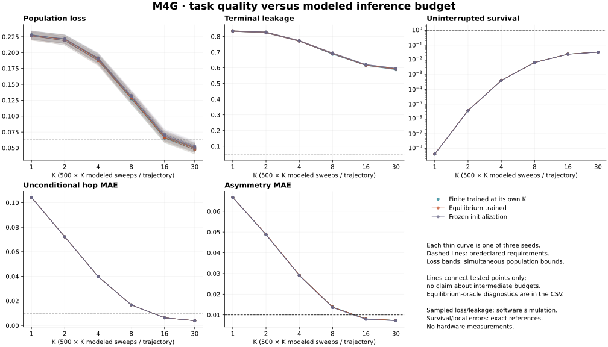

# M4G: task quality versus inference budget

Recorded decision: **both_quality_failure**.
All 21 fits, 105 updates, 60 held-out cells and 18 paired comparisons are retained.
The frozen protocol, original initialization, five-update selection and 213 role
seeds are unchanged. Every fit was frozen before any held-out evaluation.

Neither method achieves the required joint quality at any tested finite budget;
all 60 cells, including frozen and equilibrium-oracle diagnostics, fail.
There is **no supported inference-sweep savings claim**. Terminal leakage spans
58.74%–83.68%, above the 5% limit, and maximum killed survival is 3.54%, below
95%. At K=30, all three members in all three seeds satisfy the population-loss
upper bound and both local error thresholds, while conservation still fails.
Good occupancy marginals and local fidelity therefore do not certify the full
one-particle task contract in this experiment.
At K=30, trained-model terminal histograms contain 44.43%–45.51% empty outputs,
40.60%–41.26% one-particle outputs and 13.88%–14.46% multiple-particle outputs.
Terminal failures are dominated by empty outputs. These are descriptive
within-cell frequencies; the simultaneous leakage gate uses its full interval.

## Complete quality grid

Each range spans the three individual seeds; no counts are pooled. Loss is the
unbiased descriptive estimate. Acceptance uses the simultaneous population-loss
bounds and leakage intervals in [the full report](report.md), together with exact
survival, hop MAE and asymmetry MAE. Statuses below list seeds 0, 1 and 2.

| Member | K | Loss range | Leakage range | Survival range | Hop MAE range | Asymmetry MAE range | Status by seed |
| --- | --- | --- | --- | --- | --- | --- | --- |
| finite | 1 | 0.226313–0.228148 | 0.83252–0.836426 | 4.16114e-09–4.16382e-09 | 0.104262–0.104265 | 0.0667162–0.0667182 | fail, fail, fail |
| finite | 2 | 0.218867–0.221356 | 0.82312–0.82843 | 3.62274e-06–3.62369e-06 | 0.0721924–0.0721947 | 0.0488042–0.0488099 | fail, fail, fail |
| finite | 4 | 0.187984–0.19069 | 0.76947–0.773346 | 0.000409507–0.000410068 | 0.0398967–0.0398985 | 0.0291552–0.0291618 | fail, fail, fail |
| finite | 8 | 0.127312–0.130183 | 0.686188–0.693756 | 0.00667254–0.00667852 | 0.0166882–0.0166947 | 0.0137723–0.0137775 | fail, fail, fail |
| finite | 16 | 0.0654754–0.0682077 | 0.614349–0.618988 | 0.0244672–0.0244852 | 0.00615533–0.00615871 | 0.00809868–0.00811055 | fail, fail, fail |
| finite | 30 | 0.0471086–0.0505192 | 0.587433–0.59314 | 0.0337757–0.0338035 | 0.00384415–0.00384695 | 0.00731612–0.00732274 | fail, fail, fail |
| equilibrium | 1 | 0.226138–0.227677 | 0.832733–0.836792 | 4.18847e-09–4.19323e-09 | 0.104258–0.10426 | 0.066693–0.0666985 | fail, fail, fail |
| equilibrium | 2 | 0.218811–0.221131 | 0.822845–0.828217 | 3.64967e-06–3.65463e-06 | 0.0721837–0.0721854 | 0.0488809–0.0488847 | fail, fail, fail |
| equilibrium | 4 | 0.18719–0.190702 | 0.769318–0.773895 | 0.00041155–0.000411996 | 0.039885–0.0398863 | 0.029189–0.0291947 | fail, fail, fail |
| equilibrium | 8 | 0.128097–0.130891 | 0.68811–0.694122 | 0.00660794–0.00661114 | 0.0167005–0.0167008 | 0.0137126–0.0137158 | fail, fail, fail |
| equilibrium | 16 | 0.0660085–0.0688807 | 0.615082–0.618011 | 0.0243076–0.0243129 | 0.00616205–0.00616544 | 0.00803685–0.00804084 | fail, fail, fail |
| equilibrium | 30 | 0.0472052–0.0507279 | 0.589691–0.593964 | 0.033762–0.0337671 | 0.00384417–0.00384631 | 0.00730631–0.00731146 | fail, fail, fail |
| equilibrium | equilibrium | 0.045448–0.0482309 | 0.587433–0.591431 | 0.03543–0.0354354 | 0.00352765–0.00353012 | 0.00705531–0.00706024 | fail, fail, fail |
| frozen | 1 | 0.226667–0.228176 | 0.833191–0.836731 | 4.16016e-09–4.16016e-09 | 0.104237–0.104237 | 0.0667079–0.0667079 | fail, fail, fail |
| frozen | 2 | 0.218898–0.22211 | 0.822784–0.828217 | 3.60561e-06–3.60561e-06 | 0.0721661–0.0721661 | 0.0487513–0.0487513 | fail, fail, fail |
| frozen | 4 | 0.188543–0.191762 | 0.769897–0.774597 | 0.000403921–0.000403921 | 0.0398724–0.0398724 | 0.029038–0.029038 | fail, fail, fail |
| frozen | 8 | 0.130594–0.132795 | 0.688416–0.695312 | 0.00646489–0.00646489 | 0.016692–0.016692 | 0.013538–0.013538 | fail, fail, fail |
| frozen | 16 | 0.0688304–0.0716433 | 0.616241–0.621307 | 0.0238625–0.0238625 | 0.00615159–0.00615159 | 0.007875–0.007875 | fail, fail, fail |
| frozen | 30 | 0.0493935–0.0529714 | 0.589783–0.597076 | 0.0332113–0.0332113 | 0.00380483–0.00380483 | 0.00717529–0.00717529 | fail, fail, fail |
| frozen | equilibrium | 0.0473252–0.050087 | 0.587494–0.594696 | 0.0348648–0.0348648 | 0.00347107–0.00347107 | 0.00694214–0.00694214 | fail, fail, fail |

Budget comparison: `{'decision': 'both_quality_failure', 'equilibrium': {'certified': None, 'possible': None, 'status': 'quality_failure'}, 'finite': {'certified': None, 'possible': None, 'status': 'quality_failure'}, 'resolved_ratio': None, 'sweep_ratio_bounds': None}`.
Null finite-budget bracket endpoints represent positive infinity on this tested
grid. They are not zero-cost budgets. No claim is made about untested horizons.

The 18 paired finite-minus-equilibrium loss comparisons are descriptive:
`{'inconclusive': 15, 'regressed': 2, 'improved': 1}`.
Their pointwise jackknife normal intervals do not govern task acceptance and
retain M1's small-sample/calibration limitations. Differences describe each
frozen pair, not a population guarantee for future training runs.

## Work and interpretation

The complete finite training grid uses
4,423,680,000 endpoint draws;
equilibrium training uses 737,280,000.
Total training is 5,160,960,000 endpoint draws,
including independent gradient references. All held-out cells together use
983,040,000 endpoint draws. Every inference cell
uses the same 32,768 independent complete trajectories. Modeled sweeps and p-bit
updates are algorithmic counts; equilibrium's finite-sweep count is null, not free.

Sampled occupancy/leakage and paired diagnostics are `software_simulation`.
Endpoint laws, local errors and killed survival are `exact_reference`. CPU timing
is observed software work, not measured device latency, energy or power. See
[reproduction and accounting](reproduction.md) and [runtime provenance](provenance.json).
No conclusion about convergence, optimal model capacity or physical hardware
follows from this fixed five-update procedure.

## Integrity and artifacts

Implementation: `sha256:0eaf7344c1c27a7e5c3964610f5eee2fd38d629ef0c0b22655d817bb78e952f4`.
Request: `sha256:8e067f27dc4ae0db95c42b8a74cbc87af4639b618e43a1eb55d0a71cde66fd69`.
Scientific result: `sha256:a9e7bf3ea2c5a37a28493a4df8287ad6d526b509994dce871db33f957533d423`.

- [Integrated preflight and preproduction review](integrated-preflight/report.md)
- [Complete replayable study](study.json), [60-cell CSV](metrics.csv), [checked report](report.md)
- [Execution record](execution.json), [production evidence reviews](evidence-review.json)
- [Repository gate records](gates.json), [final completion](completion.json)
- [Verification details](verification.md)
