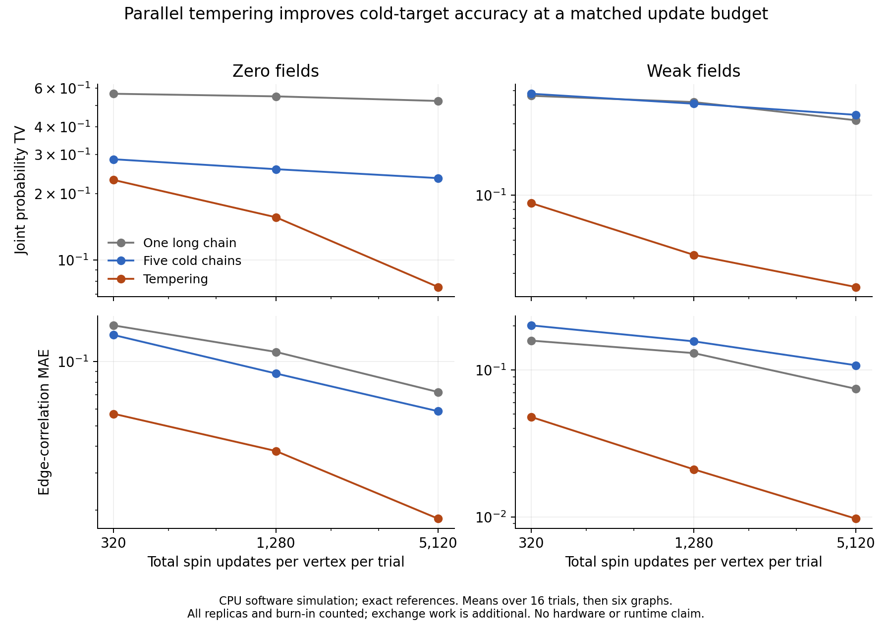

# Fixed-budget sampling: tempering earns the next experiment

Parallel tempering passed the predeclared exploratory signal: at the largest
matched spin-update budget, mean joint-probability error was **3.11 times lower
on zero-field targets and 13.05 times lower on weak-field targets** than the
better baseline. It reduced error on all 12 targets. This supports pursuing
replica exchange for difficult cold-target inference on this small graph
family; it does not establish a runtime or hardware advantage.

The [frozen protocol](../../experiments/fixed-budget-sampling.md) compares one
long cold Gibbs chain, five independent cold chains and five tempered replicas.
The same systematic single-site JAX Gibbs rule is used throughout. The cold
inverse temperature is 4; the fixed ladder is [0.25, 0.5, 1, 2, 4]. All arms
include burn-in in the budget, and tempering pays for all five replicas.
Its exchange work is counted separately. These are `software_simulation`
results on CPU against exhaustive `exact_reference` probabilities.



## Results

The primary metric is total variation distance between the sampled and exact
joint probabilities of spins 0–3: half the sum of absolute errors over 16 bins.
Each entry averages 16 independent trials within a target, then averages the
six graphs equally. Lower is better. All budgets are prefixes of the same runs.

| Fields | Total spin updates per vertex per trial | One long chain | Five cold chains | Tempering |
| --- | ---: | ---: | ---: | ---: |
| Zero | 320 | 0.56546 | 0.28577 | 0.23030 |
| Zero | 1,280 | 0.55030 | 0.25763 | 0.15609 |
| Zero | 5,120 | 0.52457 | 0.23472 | **0.07542** |
| Weak | 320 | 0.46237 | 0.47719 | 0.08847 |
| Weak | 1,280 | 0.41985 | 0.40946 | 0.03991 |
| Weak | 5,120 | 0.31711 | 0.34484 | **0.02431** |

At the largest budget, each trial costs **61,440 redraws for 12 spins** or
**81,920 for 16 spins**. Tempering additionally attempts **2,048 exchanges**.
The long-chain and independent-chain estimators retain 3,840 cold states per
trial, while tempering retains only 768. Its improvement survives this smaller
cold sample count at the matched total redraw budget.

The secondary edge-correlation metric also improves, so the result is more
than restoring 50/50 marginal symmetry:

| Fields, largest budget | Long-chain edge MAE | Independent edge MAE | Tempering edge MAE |
| --- | ---: | ---: | ---: |
| Zero | 0.07199 | 0.05846 | **0.01823** |
| Weak | 0.07441 | 0.10766 | **0.00972** |

Every target is retained below; these are mean trial primary errors at the
largest budget, not best-run selections.

| Graph | Fields | Long | Independent | Tempering |
| --- | --- | ---: | ---: | ---: |
| n12, seed 100 | Zero | 0.58848 | 0.35866 | 0.06628 |
| n12, seed 100 | Weak | 0.03201 | 0.39445 | 0.01493 |
| n12, seed 101 | Zero | 0.57238 | 0.24913 | 0.10171 |
| n12, seed 101 | Weak | 0.20593 | 0.36844 | 0.01776 |
| n12, seed 102 | Zero | 0.50000 | 0.15000 | 0.04956 |
| n12, seed 102 | Weak | 0.60421 | 0.46438 | 0.03323 |
| n16, seed 100 | Zero | 0.50000 | 0.21776 | 0.11215 |
| n16, seed 100 | Weak | 0.39591 | 0.26136 | 0.03619 |
| n16, seed 101 | Zero | 0.50008 | 0.22751 | 0.07209 |
| n16, seed 101 | Weak | 0.38337 | 0.30227 | 0.01971 |
| n16, seed 102 | Zero | 0.48647 | 0.20527 | 0.05072 |
| n16, seed 102 | Weak | 0.28127 | 0.27811 | 0.02403 |

The worst tempering target still has TV 0.11215. The twofold signal applies
to the field-group means; it is not an absolute accuracy guarantee or a
twofold win on every graph. Adjacent-pair exchange acceptance ranges from
22.8% to 97.9% across target/pair combinations at the largest budget.
Acceptance alone is not a mixing certificate.

## Validation and limits

The three-spin fixture has exact Gibbs stationarity residual 1.67e-16 and
exchange detailed-balance residual 1.39e-17. Reversing the exchange sign gives
residual 0.0521 and fails the check. Fixture empirical cold-distribution TV
was 0.00146 (long), 0.00229 (independent) and 0.00742 (tempering), below the
predeclared 0.04 tolerance. A zero-coupling test checks unbiased redraws and
unit exchange acceptance. Evidence tests exercise overwrite protection and
trace-corruption rejection. Full persisted replay passed for all **108 cells**.

The graph seeds 100/101/102 are fresh relative to earlier pilots, but the
family is unchanged: a ring plus a disjoint matching with weights 1..5.
The same three seeds are used at both sizes, and each field variant shares
its graph. These are not twelve independent problem-family replications.
Only 12/16-spin models, one cold temperature and one ladder were tested.
The four-spin projection and edge moments do not certify the full joint law.
There is no confidence interval based on treating correlated states as trials.
Sampling uses float32 arithmetic; enumeration uses float64 on the same rounded
parameters. This is a JAX allocation-strategy comparison, not a THRML speed test.

Generation took 23.05 seconds, including fixture sampling, enumeration,
compilation, initialization, warm-up, three synchronized timing launches,
scoring and trace persistence; interpreter/setup and final JSON write are
excluded. Replay took 1.32 seconds. The cloud session had a four-CPU quota and
16 GiB memory limit. These are evaluator observations from the archived run;
the broader test suite overlapped part of execution, so timings must not be
used for a throughput comparison. Repeated timing launches reuse keys and do
not add independent trials. No device-latency, energy or TSU claim follows.

## What to do next

Keep this fixed tempering ladder as a reference candidate. The cheapest useful
follow-up is a held-out **time-to-accuracy** comparison with an explicit error
threshold and exchange overhead included, plus a symmetry-aware baseline on
zero-field models. Then test a different target family, such as the denoising
posterior already explored, before scaling model size or adding another language.
The current result establishes an accuracy benefit per redraw on this family;
complete execution cost and transfer to other inference tasks remain open.

## Reproduction and artifacts

`evidence.tar.gz` contains the immutable request, all per-trial metrics, packed
traces, completion marker, and snapshots of the runner, helpers, protocol and
dependency lock. `manifest.json` authenticates the archive and every member.
The request digest is
`sha256:7fe6b11624be109e5382f2892fee95c525e57e1f5b7b15437bef4200b89b383d`.
The [earlier exploratory pilots](../2026-10-01-exploratory-pilots/summary.md)
are archived separately. The plot is derived solely from this archive;
`plot.py` uses a separate environment with matplotlib and changes no dependencies.

From the repository root:

```bash
export OPENBLAS_NUM_THREADS=1 OMP_NUM_THREADS=1 JAX_PLATFORMS=cpu
export JAX_ENABLE_X64=false
uv sync --frozen
uv run --frozen python -m thermo_lab.fixed_budget_sampling \
  --output-dir results/fixed-budget-new
```

For replay without sampling, extract `evidence.tar.gz` into a fresh directory,
then point `--output-dir` at the extracted `fixed-budget-sampling/` directory
and add `--replay`. Replay authenticates sources, traces and requested inputs,
then reconstructs exact references, initialization, fixture checks, all metrics,
exchange rates and work counts. It does not regenerate trajectories or timings.
The completion marker is written last after successful replay. The runner and
shared helpers are now hash-bound; future changes belong in a separate module.

Replay compares numerical records bitwise, so use the declared environment.
An archive test with default multithreaded BLAS exposed reduction-order changes
up to 1.36e-14 in reference-derived scalars; the scientific conclusions did not
change, but strict replay correctly rejected the difference. The archive test
now starts a subprocess with the recorded single-thread BLAS/JAX settings.
Bitwise replay across different numeric runtimes or CPU implementations is not
guaranteed. The original archived evaluator and evidence were preserved.

## Repository verification

- Six sampler/evidence tests passed, including full archive replay and the
  isolated numerical-environment check; 16 related hashing, diagnostic and
  exact-Ising tests also passed.
- Repository-wide Ruff formatting/lint, offline lock validation, package build
  and the Torx/THRML smoke command passed.
- The bare full suite was interrupted after 19 passes while executing the
  legacy composed-program integration study. The non-slow unit selection was
  also interrupted during the legacy aggregation fixture. Neither broad
  suite completed, so this is not a full-suite pass. No production M4/M5
  evaluator or dependency was changed.

These are the original study-time checks. See the
[consolidated PR verification](../../research/2026-10-02-sampling-synthesis.md#verification-for-the-pr)
for subsequent verification and publication of the full research series.
