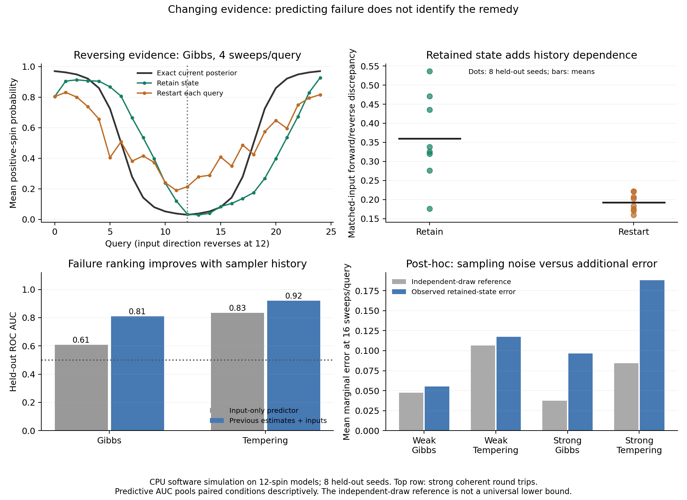

# Changing evidence: failure prediction does not identify the right remedy

The [frozen experiment](../../experiments/changing-evidence.md) completed **416
batched cells and 83,200 query estimates**, with full persisted replay. Retaining
state often reduces repeated initialization error, but creates measurable
history dependence. The state-aware predictor ranks failures better than its
input-only control; the resulting restart policy does not establish a dependable
improvement over retaining state. On these 12-spin cases, cached exact
enumeration is the fastest measured way to obtain the requested probabilities.

These are CPU `software_simulation` results with `exact_reference` probabilities.
The 83,200 estimates are not independent experiments: there are eight independent
development seeds and **eight held-out model/stream seeds**, each reused across
conditions, methods and budgets. Evidence changes between queries, not during
one sampler execution. This is repeated static inference, not a temporal filter.



## Model and comparison

Each sequence has 25 queries on a 3x4 nearest-neighbor ferromagnetic Ising map.
Two coupling strengths (0.25/0.65), two evidence directions (coherent/checkerboard)
and four schedules (stationary, gradual, abrupt, round trip) give 16 conditions.
Small independent coupling multipliers and field offsets vary with stream seed.
The target at a query depends only on current evidence. Previous sampler states
are a computational shortcut and do not count as observations.

Cross Gibbs/tempering with retained/uniformly restarted states at T=4,16,64
sweeps per query. Both use five replicas and pay 5*T*12 spin redraws; tempering
also pays 2T exchanges. Discard the first quarter at each query. Gibbs retains
all five cold chains; tempering retains its one cold replica. Accordingly,
at T=16 the estimates use **60 versus 12 cold observations**, with correlations
within each chain. All hot states, starts and exchange flags remain archived.

Primary error is marginal MAE, with failure defined as >0.05. Full-joint TV,
edge errors and alarm probability errors are retained separately. The synthetic
alarm event is at least eight positive spins; false negatives cost 4 and false
positives cost 1. Expected excess decision cost is evaluated under the exact
current posterior. It is a declared utility, not a real-sensor accuracy claim.

## Memory helps initialization and can also delay response

At strong coupling with coherent stationary evidence and T=4, retained Gibbs
reduces mean marginal error from **0.1459 to 0.0423**. Repeatedly restarting
keeps paying a short-run initialization penalty.

On strong coherent round trips at the same budget, the mean discrepancy between
forward and reverse estimates at identical inputs is **0.3598 retained versus
0.1928 restarted**. The exact posteriors at those matched inputs are identical.
The paired difference is 0.1670, with an exploratory seed-bootstrap 95% interval
[0.0852, 0.2489]. The nonzero restarted discrepancy includes sampling noise;
the additional retained-state discrepancy is evidence of history dependence
in this finite-compute procedure, not a physical-hardware hysteresis result.

In that round-trip condition, mean marginal error is 0.2000 retained versus
0.2156 restarted, while expected excess decision cost is 0.2624 versus 0.1980.
Those paired error/cost differences have wide intervals including zero. They
illustrate why both metrics matter, rather than establish a general trade-off.

Abrupt-change recovery also depends on estimation noise. At strong coherent
evidence and T=16, retained Gibbs sustains MAE<=0.05 from one query after the
change in seven seeds and seven queries after in the eighth. Restarted Gibbs
needs 3–11 queries under the same sustained criterion. These are observed
threshold crossings, not mixing-time certificates; intermittent noisy estimates
can postpone a sustained crossing even after the state has adapted.

## Main probability results

Held-out mean marginal MAE at **T=16**, averaging the four schedules equally.
These descriptive averages do not certify every query or the full joint law.
All T=4/16/64 results and individual stream values remain in the archive and
`analysis.json`; no failing condition was dropped.

| Coupling / evidence | Retain Gibbs | Restart Gibbs | Retain tempering | Restart tempering |
| --- | ---: | ---: | ---: | ---: |
| Weak / coherent | 0.0501 | 0.0502 | 0.1069 | 0.1070 |
| Weak / checkerboard | 0.0609 | 0.0608 | 0.1275 | 0.1275 |
| Strong / coherent | 0.0520 | 0.0757 | 0.0790 | 0.0822 |
| Strong / checkerboard | 0.1410 | 0.1441 | 0.2977 | 0.2904 |

At T=64, retained Gibbs reaches mean error 0.0249/0.0304 on the weak cases,
0.0282 on strong coherent cases, but still 0.1112 on strong checkerboard cases.
Increasing work helps without making all regimes accurate. At T=4, the strict
confidently-wrong alarm criterion occurs 2/3,200 times for retained Gibbs,
0/3,200 restarted Gibbs, 5/3,200 retained tempering and 17/3,200 restarted
tempering. It occurs zero times in the fixed arms at T=16/64 under this very
strict definition; moderate probability or decision errors still occur.

## A predictive signal is not evidence that resetting will help

Separate logistic models were fitted on development retained-state runs at
T=16, then frozen before any held-out generation. Inputs available before the
current query include evidence change, previous estimated marginals, known
coupling strength and query index. The control excludes previous-state features.

| Sampler | Input-only AUC | State-aware AUC | Input-only Brier | State-aware Brier | Failure prevalence |
| --- | ---: | ---: | ---: | ---: | ---: |
| Gibbs | 0.608 | **0.810** | 0.2424 | **0.1694** | 56.8% |
| Tempering | 0.834 | **0.920** | 0.1034 | **0.0790** | 85.3% |

AUC measures ranking; these values pool the fixed conditions descriptively.
Per-seed values are saved. They do not establish an early-warning detector for
trapping within every condition, calibration on new problem families, or that
failure comes from stale initialization. High failure prevalence matters.

The intervention resets when predicted failure probability is >=0.5, at exactly
the same sampling budget. It resets after the first query on **62.1% of Gibbs
queries and 90.3% of tempering queries**. Its monitoring and reset costs are timed.

- Against always retaining Gibbs state, the policy raises mean marginal error
  by **0.00226**; paired exploratory bootstrap interval [0.00025, 0.00415]. It
  improves over always restarting by 0.00443, but that is a weaker baseline.
- For tempering, the policy changes mean marginal error by -0.00106 versus
  retaining state; interval [-0.00279, 0.00056]. It closely resembles always
  restarting. No dependable accuracy improvement is established.
- Neither policy establishes lower expected decision cost than retention;
  the corresponding intervals include zero.

The predeclared restart policy should not be adopted as an improvement.
Recognizing likely estimation error is insufficient to choose an effective
intervention. The paired outcomes now support a more specific future question:
whether a policy can predict the *benefit of restarting*. Any redesigned policy
needs new held-out streams; these held-out results cannot become its test set.

## Separate post-hoc diagnostic: finite-sample estimation noise

After the frozen run, an analytic calculation evaluated the expected absolute
error of empirical marginals from the same number of **independent exact draws**.
For K~Binomial(N,p), E|K/N-p| is computed from the exact p and N. The closed form
was checked against direct binomial summation. This uses **zero new samples**
and leaves the frozen study unchanged. It is a reference for sample proportions,
not a universal lower bound: conditional expectations or antithetic estimates
can do better.

| Coupling / retained sampler, T=16 | Independent-draw expected MAE | Observed MAE | Ratio |
| --- | ---: | ---: | ---: |
| Weak / Gibbs | 0.0473 | 0.0555 | 1.17 |
| Weak / tempering | 0.1063 | 0.1172 | 1.10 |
| Strong / Gibbs | 0.0376 | 0.0965 | 2.57 |
| Strong / tempering | 0.0843 | 0.1883 | 2.23 |

Much of the weak-regime error is already present under independent sampling,
especially with only 12 retained cold observations for tempering. A restart
does not add observations. The strong regimes have substantially more error
than that reference, consistent with additional mixing/tracking limitations.
This comparison does not uniquely decompose bias, autocorrelation and lag.

## What to test next

The cheapest next question is whether better probability estimators reduce
error at the same sampling budget. For example, average a spin's conditional
probability given its neighbors instead of only counting its realized binary
values. This targets sampling variance directly. It does not repair an incorrect
distribution of neighbor states, so strong-coupling failures may remain. Any
additional estimator work must count toward measured execution time.

A second question is whether an intervention policy can predict the paired
error reduction from restarting, rather than the probability of failure under
retention. The current development data can support that design, but validation
needs new held-out streams. Uniform restart is the only reset intervention
tested here; evidence-informed initialization and additional sampling are
separate, untested alternatives. Retention remains the necessary baseline.

Larger instances should follow only with a credible reference method and
end-to-end timing. The present exact baseline wins at 12 spins; this study does
not locate the size or model family where stochastic inference becomes useful.

## Input magnitude, exact baselines and execution costs

All abrupt changes have mean input RMS change approximately 0.7000, but the
exact consecutive-posterior TV is very different:

| Coupling | Coherent change | Checkerboard change |
| --- | ---: | ---: |
| Weak | 0.9188 | 0.5983 |
| Strong | 0.9959 | 0.2782 |

Input-change magnitude alone misses how the distribution reorganizes.
Target displacement is measured offline with exact references; the policy
cannot read it.

Cached exact enumeration is faster than **all 224 held-out sampled pipelines**:
sampled/exact warm time ratios range **1.81–21.57**, median **6.24**. The median
exact cost is **4.79 ms per eight-stream, 25-query batch**. At T=16, retained
sampled methods typically take about 23–26 ms for that batch, with restarts
typically around 31–38 ms. Exact enumeration also returns exact probabilities.
It is the practical winner for these tiny instances and this CPU implementation;
the exponential state count prevents extrapolating this ranking to larger maps.

Sampled timing includes feature/policy evaluation, needed random initialization,
field transfer, state selection, all Gibbs/exchange work, synchronization,
complete trace transfer and estimation. The exact timer includes normalization
and the same requested probability summaries with cached states/interaction
scores. Both exclude offline scoring, plotting and persistence. Sampler
compilation took **2.56 s total**; key/input setup took 154–207 ms per condition,
and exact setup 7.6–9.9 ms. These setup costs are separate from warm timings.
Coupling installation on the JAX device is also outside the query timer and
was not separately measured in this study. The conditional-estimation follow-up
records that installation cost explicitly. Neither study's warm measurements
are complete cold-start application latency.

Three repeats share keys and are not extra trials. Across held-out cells the
median maximum/minimum batch-time ratio is 1.14, largest 1.94. No other study
or test suite ran during measurement. The sampled implementation returns every
replica for auditing; it is not a minimal deployment pipeline. Recorded changed
field values, initializer writes, returned trace bits, redraws and exchanges are
software work counts, not measured chip operations, latency or energy.

### PR-review correction: generated random spins versus applied resets

The archived `initialized_spins` field counts spins written into selected
resident states. It undercounts total random generation for the adaptive policy:
whenever any stream resets, the batched implementation generates fresh states
for all eight streams and discards the rows whose reset mask is false.

| Held-out T=16 policy | Applied reset spins (archived count) | Random spins generated | Generated and discarded |
| --- | ---: | ---: | ---: |
| Gibbs | 122,220 | 136,320 | 14,100 |
| Tempering | 174,120 | 190,080 | 15,960 |

Actual generation exceeds the applied-reset count by 11.54%/9.17%. The fixed
retain/restart arms have no such mismatch. `audit_initialization.py` reproduces
the counts for all 416 cells from the saved reset masks;
`initialization-accounting.json` authenticates its source and the unchanged
archive. This is a separate post-hoc accounting correction, with zero new
samples. The original protocol intended to count random initialization, so its
archived count must be interpreted with this correction. Sampling redraws,
swap counts, policy decisions and accuracy are unaffected. The recorded query
timings already include all actual random generation, including discarded rows.

## Limits, evidence and reproduction

This is a synthetic, correctly specified model with 12 binary variables, two
coupling strengths and four fixed schedules. New seeds change small coupling
and field offsets within those same families. There is no temporal prior,
model-mismatch experiment, irregular arrival timing, real sensor data, physical
hardware measurement or new dependency. Unadjusted seed-bootstrap intervals
in the descriptive analysis use eight held-out seeds; correlated queries and
conditions are never promoted to independent repetitions.

Generation took **87.27 s**, including fixtures, setup, compilation, exact
references/timings, warm-ups, three timing repeats, scoring, predictor training
and trace persistence. It excludes request/source copying, final JSON write
and replay. Full saved-evidence replay took **10.37 s**. These are evaluator
costs, not application latency.

`evidence.tar.gz` (26,873,928 bytes) preserves 15 authenticated members: request,
development cells, frozen policy, results, packed traces, completion and source/
protocol/lock snapshots. `manifest.json` hashes the archive and all members.
`analyze.py` reproduces descriptive summaries and the separately labeled iid
diagnostic; `analysis.json` authenticates both its source and source archive.
`plot.py` produces the PNG/PDF using a plotting-only matplotlib installation.

Request digest:
`sha256:e83e6b1ef61787e05c3e41ecff2c454d11339198ab156a43a5d3c5bb9fb90ee3`.

```bash
OPENBLAS_NUM_THREADS=1 OMP_NUM_THREADS=1 JAX_PLATFORMS=cpu JAX_ENABLE_X64=false \
  uv run --frozen python -m thermo_lab.changing_evidence \
  --output-dir results/changing-evidence-fresh
```

For replay, extract the archive to a fresh directory and pass its
`changing-evidence/` directory with `--replay`. Replay authenticates source,
request, policy, development and trace artifacts; reconstructs references,
initialization or state continuity, every metric/feature/decision/work count,
timing medians and development-only predictor fits; then checks held-out
predictions. It cannot reproduce historical timings or regenerate trajectories.
Numeric derived values use atol=2e-10, rtol=0; identities, hashes and counts
remain exact. Completion was written last. Frozen evaluators must not be edited.

Verification: **38 targeted tests passed**, including complete new-archive
replay, tamper rejection, batched-sampler bitwise equivalence, independent exact
references, causal features, utility, predictor controls, the three previous
sampling archives and related hashing/diagnostic/exact-Ising tests.
Repository formatting/lint, frozen dependency checks, source/wheel builds and
the Torx/THRML smoke check passed. Both package artifacts contain the new module
and all ten experiment configurations. The earlier 2,447-test repository run
ended without a completion summary and is not counted as a pass. See the
[consolidated PR verification](../../research/2026-10-02-sampling-synthesis.md#verification-for-the-pr)
for the final checks against current main.
