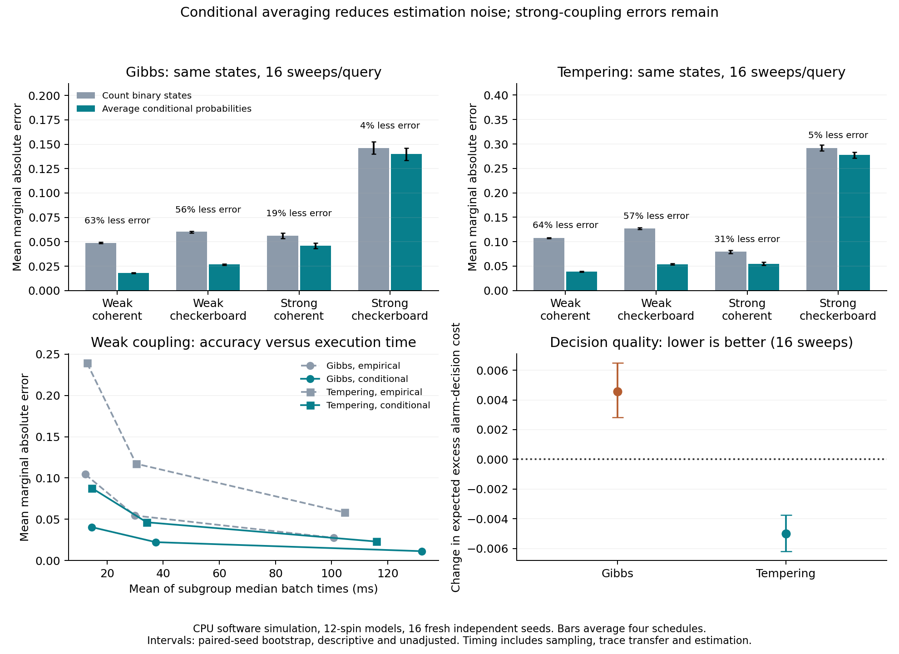

# Better probability estimates from the same sampled states

Conditional averaging improves marginal estimates in this fresh-seed test,
especially at weak coupling. At the primary budget of 16 sweeps per query,
mean marginal error falls **26.1% for Gibbs and 29.9% for tempering** while
median paired execution time rises **26.3% and 7.4%**, respectively. The difficult
strong-checkerboard cases improve only 4–5%. Gibbs alarm decisions become
slightly worse despite better average probability estimates.

The [frozen protocol](../../experiments/conditional-estimation.md) completed
**96 shared trajectory cells, 192 estimator cells and 76,800 query estimates**.
All persisted evidence replayed. The replication unit is one of **16 fresh
model/stream seeds (900–915)**, paired across methods and conditions; the query
count is not the number of independent experiments. Results are CPU
`software_simulation`, with `exact_reference` probabilities on 12-spin models.



## What changed

The sampler is unchanged. Each query uses the previous terminal states as its
starting point, then runs Gibbs or tempering for T=4,16,64 sweeps. The two
estimators use identical retained cold states. Equality of states and exchanges
was checked bitwise across both estimator arms and every timing repeat.

The empirical estimator counts binary outcomes. The conditional estimator
instead averages each spin's known conditional probability given its neighbors.
It also estimates edge products and the alarm event by their corresponding
conditional expectations. It does not multiply estimated marginals together
to approximate the joint event.

Model families, fields and query schedules match the previous changing-evidence
study: 3x4 ferromagnetic maps, weak/strong coupling, coherent/checkerboard
evidence, and stationary/gradual/abrupt/round-trip schedules of 25 queries.
No policy is trained or tuned. Each current target uses current evidence only;
this is repeated static inference, not temporal Bayesian filtering.

Gibbs uses five cold chains; tempering uses one cold replica and four hot ones.
Both pay for all five replicas' redraws, and tempering also pays for exchanges.
After quarter burn-in, T=16 yields **60 Gibbs versus 12 tempering cold states
per query**. Neither estimator adds sampling work. Conditional estimation adds
18,000/3,600 site-probability evaluations per 25-query stream, respectively.

## Primary results at 16 sweeps

Average over all conditions and queries within each seed, then average the
16 independent seeds. Intervals are paired seed-bootstrap 95% intervals using
the predeclared 10,000 resamples. They are descriptive and unadjusted for
multiple comparisons; held-out families are the same synthetic families as
the earlier experiment.

| Algorithm | Empirical marginal MAE | Conditional marginal MAE | Paired change, conditional minus empirical | Relative reduction |
| --- | ---: | ---: | --- | ---: |
| Gibbs | 0.07789 | 0.05758 | -0.02031 [-0.02049, -0.02014] | 26.1% |
| Tempering | 0.15149 | 0.10624 | -0.04524 [-0.04565, -0.04482] | 29.9% |

Every seed's aggregate primary change favors conditional estimation. Across
all three budgets, all 96 trajectory-cell means improve. This does not mean
every query improves: the separately inspected T=16 query counts are
6,082/6,400 improved for Gibbs and 6,127/6,400 for tempering. The other queries
worsen; these correlated query counts are descriptive only.

The fraction of T=16 queries with marginal MAE>0.05 falls from **54.6% to 27.8%**
for Gibbs and **85.0% to 47.1%** for tempering. Many queries still fail.

| Coupling / evidence | Gibbs empirical → conditional | Reduction | Tempering empirical → conditional | Reduction |
| --- | ---: | ---: | ---: | ---: |
| Weak / coherent | 0.04881 → 0.01788 | 63.4% | 0.10760 → 0.03862 | 64.1% |
| Weak / checkerboard | 0.06017 → 0.02674 | 55.6% | 0.12689 → 0.05410 | 57.4% |
| Strong / coherent | 0.05630 → 0.04582 | 18.6% | 0.07939 → 0.05487 | 30.9% |
| Strong / checkerboard | 0.14628 → 0.13986 | 4.4% | 0.29207 → 0.27739 | 5.0% |

This pattern supports the previous sampling-noise diagnosis: averaging
conditionals removes a substantial source of error at weak coupling. It does
little to repair the hardest regime. Conditional expectations remain dependent
on the distribution of neighboring states, so biased or poorly mixed neighbors
can leave large errors. This experiment does not uniquely separate bias,
autocorrelation and tracking lag.

## Execution costs and a useful cross-budget comparison

Warm timings include initialization at query zero, field transfer, Gibbs and
exchange work, synchronization, complete all-replica trace transfer and all
three observable estimates. Compilation, key/input planning, model installation,
offline scoring, packing and persistence are reported separately. There is no
predictor or restart-monitoring overhead in this follow-up.

| Algorithm / sweeps | Empirical mean MAE | Conditional mean MAE | Empirical batch ms | Conditional batch ms |
| --- | ---: | ---: | ---: | ---: |
| Gibbs / 4 | 0.12805 | 0.08699 | 12.08 | 14.82 |
| Gibbs / 16 | 0.07789 | 0.05758 | 29.52 | 37.29 |
| Gibbs / 64 | 0.04913 | 0.03887 | 99.96 | 131.66 |
| Tempering / 4 | 0.25117 | 0.15689 | 12.60 | 14.02 |
| Tempering / 16 | 0.15149 | 0.10624 | 31.08 | 33.17 |
| Tempering / 64 | 0.08418 | 0.06172 | 105.91 | 113.44 |

Times are medians across condition-level medians of five complete executions,
each batch containing **16 streams x 25 queries**. They are not single-query
latencies. At T=16, the separate median estimator portions are 3.75→11.37 ms
for Gibbs and 2.41→4.61 ms for tempering. Gibbs processes five times as many
cold observations. Median paired time ratios are 1.263 and 1.074; a ratio of
the two displayed medians need not equal a median of paired ratios.

At **weak coupling**, conditional estimation with 16 sweeps beats empirical
estimation with 64 sweeps on mean marginal error: paired changes are
-0.00529 [-0.00599, -0.00463] for Gibbs and -0.01194 [-0.01278, -0.01116] for
tempering. The paired median time ratios are 0.374 and 0.323: roughly
**2.7x and 3.1x faster** in this descriptive comparison. The comparison averages
both evidence directions and all four schedules. At strong coupling, the
16-sweep conditional estimates remain less accurate than 64-sweep empirical
estimates. These three budgets do not establish a time-to-accuracy certificate.

Cached exact enumeration takes a median **10.45 ms per batch**. It is faster
than every conditional arm and 190/192 sampled estimator cells. Two empirical
T=4 cells are slightly faster than their paired exact measurement, but have
mean marginal errors 0.0871 and 0.0762. Exact enumeration remains a strong
practical baseline at this size. No large-model or hardware advantage follows.

Measurements ran without other studies/tests consuming CPU; the older full
pytest process was paused for 85 seconds and resumed afterward. Five repeats
reuse keys and are not independent experimental seeds. Their max/min time
ratio has median 1.18 and maximum 1.75. Compilation totaled 2.87 seconds,
key/input setup took 308–472 ms per condition, and model installation and exact
setup observations are retained in the archive. This is an audited trace-returning
implementation, not an optimized deployment pipeline.

## More accurate probabilities can still produce worse decisions

Edge-correlation MAE improves substantially at T=16: Gibbs **0.08326→0.03828**,
tempering **0.18346→0.08052**. Alarm probability MAE improves only slightly:
Gibbs **0.08092→0.07856**, tempering **0.15125→0.14577**.

The alarm is at least eight positive spins. False negatives cost four and false
positives cost one, so the fixed action threshold is 0.2. Expected excess cost
is computed against the exact Bayes action, not from simulated real outcomes.

| Algorithm | Empirical excess cost | Conditional excess cost | Paired change and 95% interval |
| --- | ---: | ---: | --- |
| Gibbs | 0.04529 | 0.04984 | **+0.00456** [+0.00281, +0.00648] |
| Tempering | 0.16988 | 0.16489 | **-0.00499** [-0.00618, -0.00376] |

For Gibbs, average probability error improves while expected decision cost
worsens. A post-hoc inspection of the already recorded actions finds 85 changes
among 6,400 queries: 30 improve exact decision cost and 55 worsen it. In the
strong-checkerboard cases, 22 actions change and all 22 worsen cost. Tempering
changes 86 actions: 73 improve and 13 worsen. These counts explain where the
cost differences arise; they do not create additional independent trials or
justify tuning the threshold on these seeds.

Average absolute error and threshold-dependent decision cost reward different
properties. Conditional averaging should therefore become a probability-
estimation baseline for this model family, with decision utility checked
separately. It is not a blanket replacement for every downstream decision.

## What this changes next

Use conditional estimates as a stronger baseline when investigating sampling
efficiency, particularly in the weak regimes. The substantial remaining error
in strong-checkerboard cases calls for a test of exploration/mixing, not another
restart alarm aimed merely at high error. A useful next mechanism comparison
would hold the improved estimator fixed and test whether a sampler that changes
correlated groups of spins reduces those residual errors, with exact controls
and fresh seeds. That mechanism is untested here.

The idea of averaging conditional expectations is established variance
reduction, not a new algorithmic discovery. The contribution of this experiment
is identifying where it helps this workload, its measured CPU overhead, and
the decision-cost limitation. Conditional expectation reduces variance for a
single stationary observation; it does not universally guarantee smaller
finite-chain error or smaller asymptotic variance for correlated trajectories.

## Evidence, checks and reproduction

Generation took **75.90 seconds**, and full saved-evidence replay took
**6.02 seconds**. A six-cell earlier-seed runtime calibration took 7.85 seconds
plus 0.34 seconds replay; it ran while the older tests were active and is used
only for runtime planning, not performance claims. Production stayed well
below the repository's 30-minute checkpoint threshold, with no time cutoff.

`evidence.tar.gz` is **22,748,250 bytes** with 15 authenticated members: request,
results, packed states/exchanges, completion, and source/protocol/lock snapshots.
`manifest.json` records the archive and member hashes. `analyze.py` reproduces
the bootstrap summaries and clearly labeled post-hoc action inspection;
`analysis.json` binds its source and archive. `plot.py` produces PNG/PDF using
the existing plotting environment, without a project dependency change.

Request digest:
`sha256:a881bfd89e0958aa0e1807ad10cdc4a1b0e2f3826be245795d915f2214cd0117`.

```bash
OPENBLAS_NUM_THREADS=1 OMP_NUM_THREADS=1 JAX_PLATFORMS=cpu JAX_ENABLE_X64=false \
  uv run --frozen python -m thermo_lab.conditional_estimation \
  --output-dir results/conditional-estimation-fresh
```

Extract the archive into a fresh directory and pass its `conditional-estimation/`
directory with `--replay` to authenticate and reconstruct the saved comparison.
Replay verifies complete grid identities, sources, traces, initialization and
continuity, exact references, both estimators, every metric/work count and
timing medians. It does not regenerate trajectories or historical wall times.
Completion was written last. All earlier evaluators remain unchanged; this
new evaluator and protocol are now hash-bound as well.

**17 targeted tests passed**, covering independent enumeration, the uncoupled
limit, cold-only selection, small-study replay/tamper rejection, full new-archive
replay and the unchanged changing-evidence/fixed-budget contracts. The older
2,447-test full repository run ended without a completion summary and is not
counted as a pass. See the
[consolidated PR verification](../../research/2026-10-02-sampling-synthesis.md#verification-for-the-pr)
for the final checks against current main.
Repository formatting/lint, the offline lock check, source/wheel builds and
package-content checks passed. All fifteen archive member hashes and current
frozen sources match, including the four earlier sampling studies. Analysis
source/archive hashes match as well. No archived evaluator was changed.
