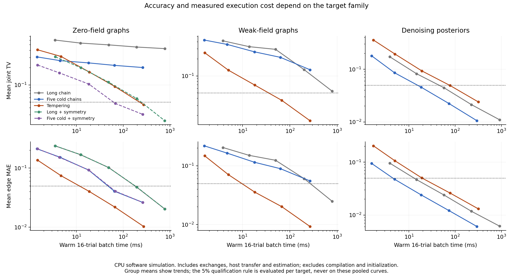

# Sampling strategy should depend on the target

The follow-up changes the recommendation from the
[October 1 experiment](../2026-10-01-fixed-budget-sampling/findings.md): use
model symmetry when available, keep ordinary Gibbs as the denoising baseline,
and use tempering for the difficult biased graph targets. Tempering is not a
universal improvement in time to accuracy.

The [frozen protocol](../../experiments/sampling-time-to-accuracy.md) tested 18
fresh targets at five budgets. It required both mean trial four-spin joint TV
and mean trial edge-correlation MAE to be <= 0.05, at a budget and all larger
tested budgets. Every target has 16 independently seeded trials. The recorded
CPU study completed all **330 cells and 66 method/target decisions**, with full
persisted replay. Sampling is `software_simulation`; enumeration is
`exact_reference`.

## What changed

| Targets qualifying within the grid | Long cold chain | Five independent cold chains | Tempering | Long + global flip | Five cold + global flip |
| --- | ---: | ---: | ---: | ---: | ---: |
| Zero-field graphs | 0/6 | 0/6 | 4/6 | **5/6** | **5/6** |
| Weak-field graphs | 4/6 | 1/6 | **6/6** | Inapplicable | Inapplicable |
| Denoising posteriors | 6/6 | 6/6 | 6/6 | Inapplicable | Inapplicable |

**Biased graphs support tempering.** It reached the threshold on every target.
On the four targets where an ordinary baseline also qualified, tempering was
3.12–44.61 times faster than the faster qualifying baseline, with median paired
ratio 35.60. Those are conditional warm CPU batch comparisons, not a speedup
assigned to the two targets whose baselines never qualified. Tempering times
ranged from 6.6 to 333.2 ms for the 16-trial batch at the qualifying budget.

**Symmetry removes much of the earlier zero-field advantage.** A state and its
global sign-flip have equal probability when all fields are zero. Averaging
their four-spin histograms adds negligible work and fixes orientation bias
without additional redraws. Both augmented baselines qualified on five targets;
tempering qualified on four, including the one neither baseline reached. On
the three targets with both kinds of success, the fastest augmented baseline
was about 5.7x and 21.4x faster on two; the other had a 2.2% timing difference
in tempering's favor, too small to interpret given timing variability. Pair
correlations are unchanged by augmentation, so it cannot repair every trap.

**Denoising is a negative transfer result for tempering.** Five independent
Gibbs chains reached the threshold faster than tempering on all six cases:
3.87–17.86x faster, median paired ratio 4.33. The independent-chain batches
took 17.9–72.2 ms, versus tempering's 72.7–319.3 ms. A single long chain was
also faster than tempering on every case and narrowly beat the independent
arm on one. For these small, model-correct posteriors, the additional hot
replicas did not repay their cost or smaller number of retained cold samples.



The figure averages errors across six targets per panel to show trends.
Qualification is assessed separately for each target, never on these pooled
curves. All five predeclared budgets and every arm remain in the evidence.

## Every time-to-accuracy decision

Cells show **milliseconds per warm 16-trial batch (T)**. T is sweeps per replica
for independent/tempering, and the long chain runs 5T sweeps. All arms pay
5*T*n redraws per trial, including burn-in; tempering adds 2T swap attempts.
“NR” means the threshold was not sustained within T <= 4096. It is not zero
time or a certified failure at all possible budgets. “—” is an invalid symmetry
operation for that target. Values are medians of five execution repeats using
the same sampling keys, not five extra statistical trials.

| Target | Long | Five cold | Tempering | Long + flip | Five cold + flip |
| --- | ---: | ---: | ---: | ---: | ---: |
| n12-g200-zero | NR | NR | 244.1 (4096) | 42.5 (256) | 55.4 (1024) |
| n12-g200-weak | NR | NR | 242.8 (4096) | — | — |
| n12-g201-zero | NR | NR | 239.7 (4096) | 675.6 (4096) | 245.1 (4096) |
| n12-g201-weak | 668.7 (4096) | NR | 15.0 (256) | — | — |
| n12-g202-zero | NR | NR | 232.2 (4096) | 10.9 (64) | 14.1 (256) |
| n12-g202-weak | 663.6 (4096) | NR | 18.2 (256) | — | — |
| n16-g200-zero | NR | NR | NR | 230.2 (1024) | 282.8 (4096) |
| n16-g200-weak | 230.9 (1024) | NR | 6.6 (64) | — | — |
| n16-g201-zero | NR | NR | 306.3 (4096) | NR | NR |
| n16-g201-weak | NR | NR | 333.2 (4096) | — | — |
| n16-g202-zero | NR | NR | NR | 879.5 (4096) | 288.6 (4096) |
| n16-g202-weak | 58.1 (256) | 67.9 (1024) | 18.6 (256) | — | — |
| denoise-g100-noise0.2 | 55.2 (256) | 18.8 (256) | 72.7 (1024) | — | — |
| denoise-g100-noise0.35 | 57.3 (256) | 17.9 (256) | 318.9 (4096) | — | — |
| denoise-g101-noise0.2 | 54.7 (256) | 18.2 (256) | 319.3 (4096) | — | — |
| denoise-g101-noise0.35 | 224.4 (1024) | 69.0 (1024) | 293.0 (4096) | — | — |
| denoise-g102-noise0.2 | 58.8 (256) | 18.4 (256) | 74.8 (1024) | — | — |
| denoise-g102-noise0.35 | 57.4 (256) | 72.2 (1024) | 318.3 (4096) | — | — |

Times include Gibbs updates, all exchanges, device trace collection,
synchronization, host transfer and computing probability/correlation estimates.
They exclude compilation, initialization, the exact oracle and persistence.
These are warm amortized batch costs, not one-shot application latency.
Compilation took 0.250–0.569 seconds per executable, 11.48 seconds for the
30 size/method/horizon executables. Initialization took 5.2–447.3 ms per target,
with the first shape also incurring setup work. These costs can dominate small
one-shot tasks and must be included in a deployment-specific comparison.

Arms were warmed and their measurement order rotated between repetitions.
No other test/study ran during timing. Median across cells of the maximum/minimum
repeat-time ratio was 1.13; the largest was 2.67. Raw repeats are retained;
small timing differences should not drive method selection. The run used JAX
0.10.2 on CPU with a four-CPU quota, 16 GiB memory limit, single-thread BLAS,
and JAX x64 disabled. This provides no hardware-energy or TSU-speed claim.

## Post-hoc check: combine symmetry with tempering

After seeing the frozen results, a separate, inexpensive analysis applied the
same analytic global-flip estimator to the already saved tempering states.
**All six zero-field targets then reached the same accuracy threshold**, at
T = 64, 256, 256, 256, 4096 and 4096 in graph order. Every estimate was checked
against explicitly duplicated complemented cold samples. This used **zero new
samples** and leaves the frozen 330-cell study unchanged.

This is an exploratory accuracy result, not a new frozen arm or measured speed
claim. The combined pipeline was not benchmarked. Its full per-trial errors,
source-archive hash and script hash are in `posthoc-symmetry.json`; reproduce
with `posthoc_symmetry.py`. Symmetry repairs global orientation while tempering
can address additional barriers. The combination merits a small fresh-seed
timing test, rather than assuming its runtime from the unaugmented arm.

## Limits and next step

Graph seeds 200/201/202 are new, but the ring-plus-matching family and small
12/16-spin sizes are unchanged. Sizes reuse seeds and field variants share
graphs. Denoising uses three exact prior draws, each at two coupled noise
levels, and the posterior model matches the generator. These dependencies and
small samples limit generalization. Parameters and sampling use float32;
references enumerate the same rounded model in float64. The denoising model is
scaled by exactly 1/4 so the reused beta-4 sampler targets its beta-1 posterior.

The thresholds concern mean trial errors of a four-spin projection and graph
edge moments. They do not guarantee each trial, the full distribution or
real-image prediction quality. Individual-trial pass fractions are retained
separately. The fourfold budget grid coarsely locates crossings; no continuous
optimal-time or converged-chain claim follows.

Use independent Gibbs as the working denoising reference and preserve tempering
as a candidate for biased frustrated graphs. For zero-field graphs, apply
known symmetry before spending additional sampling work. The cheapest next
experiment is timing the combined symmetry-plus-tempering estimator on fresh
graphs, with the same thresholds and a strongest-baseline comparison. There
is no evidence here that a new language or GPU would resolve the main accuracy
differences; algorithm choice is the useful lever at this scale.

## Evidence and reproduction

Generation took 298.48 seconds, including fixtures, exact references,
compilation, initialization, maximum traces, warm-ups, repeated timings,
prefix checks, scoring and trace persistence. It excludes request construction,
interpreter/setup, final JSON write and replay. Full replay took 2.36 seconds.
These are evaluator observations with the stated scope.

`evidence.tar.gz` (17.73 MB) preserves all requested inputs, 330 cells of
per-trial errors and raw timing repeats, 66 decisions, packed maximum-horizon
traces, fixture traces, completion and frozen source/lock/protocol snapshots.
All hot-replica states are retained as specified. `manifest.json` authenticates
the archive and every member. Request digest:
`sha256:59923617c0c84db837af98d7b9cc3bdee87ff6fc25982606b596b09562c485cf`.

```bash
export OPENBLAS_NUM_THREADS=1 OMP_NUM_THREADS=1 JAX_PLATFORMS=cpu JAX_ENABLE_X64=false
uv run --frozen python -m thermo_lab.sampling_time_to_accuracy \
  --output-dir results/sampling-time-fresh
```

For replay, extract the archive into a fresh directory and point the same
command at its `sampling-time-to-accuracy/` directory with `--replay`. Replay
authenticates hashes and recomputes initialization, fixtures, exact references,
all estimates/errors/counts/exchange rates, timing medians and threshold choices.
It does not reproduce historical timings or resample trajectories. Float-derived
comparisons use atol=2e-12, rtol=0; identities, counts and decision outcomes are
exact. Completion is written last. The archived sampler and both study modules
are now hash-bound and must remain unchanged.

The plotting script reads only the archive and uses matplotlib in a separate
plotting environment. No project dependency changed.

Verification: 28 targeted sampler, archive, hashing, diagnostic and exact-Ising
tests passed. The new archive test authenticates every member and replays all
330 cells and 66 decisions in the recorded numerical environment. The earlier
108-cell archive still replays. Broad legacy integration studies were not rerun;
their incomplete prior verification remains documented in the October 1 report.
Repository-wide formatting/lint, offline lock validation, source/wheel builds,
and the Torx/THRML smoke command also passed after the experiment. Archive/member
hashes, post-hoc source hashes and report links were checked. No commit or push
was made.

These are the original study-time checks. See the
[consolidated PR verification](../../research/2026-10-02-sampling-synthesis.md#verification-for-the-pr)
for subsequent verification and publication of the full research series.
