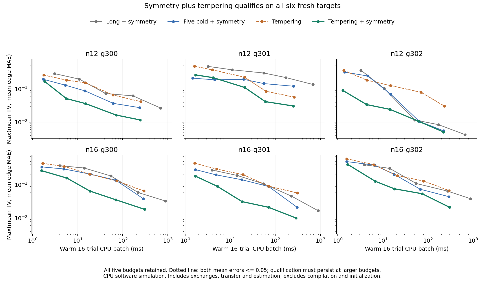

# Symmetry plus tempering transfers to six fresh zero-field graphs

The combined estimator reaches the predeclared accuracy threshold on **6/6**
fresh targets. Both symmetry-aware ordinary Gibbs baselines reach **5/6**;
unaugmented tempering reaches **2/6**. Against the faster qualifying ordinary
baseline, the combination is **4.05–12.33x faster on four targets**. The fifth
paired comparison is within 4%, too small to interpret given timing variability.
No time ratio is assigned to the sixth target, where neither ordinary baseline
qualifies within the tested budgets.

This is the prospective follow-up to the previous study's
[post-hoc symmetry analysis](../2026-10-02-sampling-time-to-accuracy/findings.md#post-hoc-check-combine-symmetry-with-tempering).
The [protocol](../../experiments/symmetry-tempering.md) froze graph seeds
300/301/302 at sizes 12/16, four arms, five budgets and 16 independent trials.
All **120 cells and 24 decisions** completed and replayed. Sampling evidence is
`software_simulation`; the enumerated references are `exact_reference`.

## Every time-to-accuracy decision

Entries are **milliseconds per warm 16-trial CPU batch (T)**. T is sweeps per
replica for independent and tempering; long runs 5T. All arms pay 5*T*n redraws
per trial including burn-in; both tempering arms also pay 2T exchange attempts.
Symmetry is an analytic estimator applied to the underlying draws, not another
sampling run. NR means not reached within T <= 4096, not failure at every budget.

| Fresh target | Long + symmetry | Five cold + symmetry | Tempering | Tempering + symmetry |
| --- | ---: | ---: | ---: | ---: |
| n12-g300 | 694.4 (4096) | 61.8 (1024) | 251.8 (4096) | **15.0 (256)** |
| n12-g301 | NR | NR | NR | **60.3 (1024)** |
| n12-g302 | 51.2 (256) | 64.0 (1024) | 231.9 (4096) | **4.4 (64)** |
| n16-g300 | 876.8 (4096) | 287.4 (4096) | NR | **71.0 (1024)** |
| n16-g301 | 226.7 (1024) | 303.1 (4096) | NR | **18.4 (256)** |
| n16-g302 | 879.6 (4096) | 291.6 (4096) | NR | 302.3 (4096) |
| Targets qualifying | 5/6 | 5/6 | 2/6 | **6/6** |

Qualification requires BOTH mean trial four-spin joint TV <= 0.05 and mean
trial edge-correlation MAE <= 0.05 at this budget and every larger tested
budget. It is assessed separately on each target. Every per-trial error and
individual pass fraction is retained in the archive. The fourfold budget grid
only coarsely locates crossings; these are not continuously optimized times.

The paired ratios of fastest qualifying ordinary baseline time to combined
time are 4.11, 11.69, 4.05, 12.33 and 0.965 in table order excluding n12-g301.
Their median is 4.11, conditional on the five jointly qualifying targets.
The last ratio corresponds to an ordinary baseline about 3.7% faster, with
both methods requiring the same largest budget; it is not a persuasive win.



The plot retains every budget and displays the larger of the two mean errors
for each target, so crossing the dotted line requires both metrics to pass.
Decisions additionally require passing at all larger tested budgets. No target
averaging is used to determine qualification. `plot.py` reads the authenticated
archive; matplotlib is a plotting-only dependency, outside the project lock.

## Why the combination helps

With zero fields, a state and its global sign flip have equal probability.
Averaging their histogram bins removes orientation imbalance without drawing
new samples. Pair correlations remain unchanged, so symmetry alone cannot fix
every distributional error. Tempering can cross additional barriers. Their
complementary effects explain why the combination merits use on this graph
family; the data do not establish a universal sampler ranking.
The two tempering arms have identical trajectories and exchange rates; their
accuracy difference comes entirely from the estimator.

On n12-g301, the strongest ordinary baselines remain above the threshold at
the largest budget: joint TV is 0.121–0.136 and edge MAE 0.094–0.105. Tempering
reduces edge MAE to 0.022 but unaugmented joint TV is 0.0566. The analytic flip
reduces that joint TV to 0.0307 while preserving the same edge estimate.

At the largest budget, all 16 combined-arm trials individually qualify on five
targets, and 15/16 do on n12-g301. This is a descriptive result at T=4096;
qualification at the earlier selected budget uses the predeclared mean rule.

## What the timings include

Each measured pipeline includes Gibbs updates, all exchanges, device trace
collection, synchronization, transfer and computing joint/marginal/edge
estimates, including symmetry. It excludes compilation, initialization,
exact enumeration, oracle scoring and persistence. Each arm is executed and
timed separately, even when its random keys are paired with another arm.

Five repeats use identical keys and rotated arm order; they are not extra
statistical trials. No other study or test suite ran during measurement.
Across the 120 cells, the median maximum/minimum repeat-time ratio is **1.15**;
the largest is **4.75**. All raw repeats remain available. Large crossing-budget
differences are more informative here than small timing differences.

Compilation took 0.235–0.580 seconds per executable, **11.40 seconds total**
for 30 executables. Initialization ranged from 5.6 to 481.6 ms per target,
including first-shape setup. Those costs can dominate a small one-shot task.
These results concern warm amortized batches, not cold-start latency.

Runtime: JAX/JAXlib 0.10.2, NumPy 2.4.6, SciPy 1.17.1, Python 3.11.16;
CPU with four-CPU quota, 16 GiB, float32 sampling, float64 references,
JAX x64 disabled and single-thread BLAS. No hardware or energy claim follows.

## Scope and next decision

This confirms the exploratory combination on new graph and sampling seeds,
with measured estimator overhead and the strongest prior ordinary baselines.
Use symmetry plus tempering as the leading candidate for this zero-field
frustrated-graph family. Keep independent Gibbs as the working reference for
the earlier denoising cases; this study supplies no new denoising evidence.

The six targets are still small ring-plus-matching graphs, with sizes sharing
seeds. The threshold covers one four-spin projection and edge moments, not the
full joint distribution or arbitrary workloads. There was no ladder tuning,
larger-size study, physical hardware access or Torx upgrade.

The useful next research question is transfer to a distinct, application-led
target with known small-case references, rather than more variants of this
same six-case comparison. Any larger-scale or hardware comparison should
include initialization, compilation amortization and all data movement.

## Reproduction and evidence

Generation took **102.17 seconds**, including fixture checks, exact references,
initialization, compilation, maximum traces, warm-ups, timing repeats, scoring
and trace persistence. It excludes request construction, interpreter startup,
final JSON write and replay. Full saved-evidence replay took **1.22 seconds**.
These are evaluator costs with the declared scope, not sampling latency.

`evidence.tar.gz` preserves the request, all errors/timings/decisions, packed
maximum traces including hot replicas, fixture traces, completion and frozen
source/protocol/lock snapshots. `manifest.json` hashes all 13 members and the
archive. Request digest:
`sha256:d33a3a5a80be935d282d44fb6adc61fdf399bb324a57c741bbfe9fbfdb93cdc2`.

```bash
OPENBLAS_NUM_THREADS=1 OMP_NUM_THREADS=1 JAX_PLATFORMS=cpu JAX_ENABLE_X64=false \
  uv run --frozen python -m thermo_lab.symmetry_tempering \
  --output-dir results/symmetry-tempering-fresh
```

For replay, extract the archive to a fresh directory and pass its
`symmetry-tempering/` directory with `--replay`. Replay authenticates sources,
request and traces, and recomputes exact/empirical fixtures, initialization,
references, estimates, errors, work, exchange rates, timing medians and all
decisions. It does not regenerate trajectories or historical timings. Numeric
derived values use fixed atol=2e-12, rtol=0; hashes and discrete values are exact.
Generation additionally verified common trace prefixes across horizons and
identical estimates across timing repetitions. Completion was written last.
The runner and every source bound by this archive must remain unchanged.

## Repository verification

- **32 targeted tests passed**: combined-estimator cold-sample/complement
  equivalence, correct replica work accounting, fresh-target controls,
  small-run replay and tamper rejection, full new-archive replay, both earlier
  sampling archives, and related hashing, diagnostic and exact-Ising checks.
- Repository-wide Ruff formatting/lint, frozen offline environment sync and
  lock validation, source/wheel builds and the Torx/THRML smoke command passed.
  Both built packages contain the new study module and all experiment configs.
- All archive/member hashes, frozen source files, result counts and report
  links were checked. The figure was inspected after rendering.
- The bare full suite collected 2,441 tests and reached **22 passes** before
  an assistant-imposed five-minute verification cutoff interrupted a legacy
  composed-program integration study. It reported no test failures before
  interruption; a JAX cleanup warning followed the interrupt. This is not a
  complete full-suite pass. Separate long legacy experiment commands were
  not rerun for this standalone study.

No dependency was upgraded, and no commit or push was made. Earlier uncommitted
work and all earlier archived sources were preserved.

These are the original study-time checks. See the
[consolidated PR verification](../../research/2026-10-02-sampling-synthesis.md#verification-for-the-pr)
for subsequent verification and publication of the full research series.
